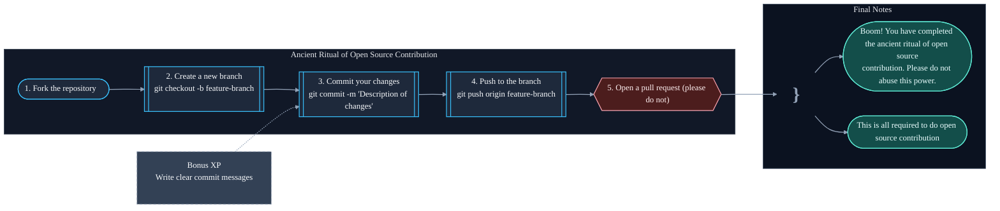

<h1 align="center">My Corner of the Internet</h1>

Why did you come here? to copy my code?

Well I made it with Gemini, Claude and Copilot -- feel free to copy mine but better design your own portfolio, not difficult to make these days and it's fun to make.

## Introduction

The whole point of this repo? So you _don’t_ have to read an introduction here.  
Check out [shravangoswami.com](https://shravangoswami.com).

This repo contains the source code for my personal website, where I post all sorts of random stuff from my life.

## Installation

Close your GitHub and go do farming if setting up a static Astro site without a guide feels scary!

## Contributing

Contributions are welcome! But why would you contribute here -- go make your own portfolio and contribute there.

## License

This project is licensed under the MIT License, so feel free to fork or clone it for any purpose. See the [LICENSE](LICENSE) file for details.

## Contact

You can reach me via [LinkedIn](https://www.linkedin.com/in/shravangoswami) or [Email](mailto:contact@shravangoswami.com).
